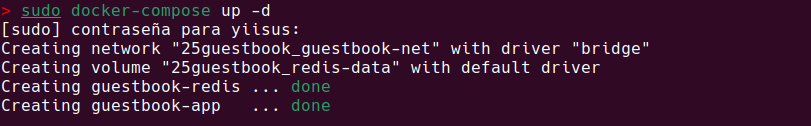
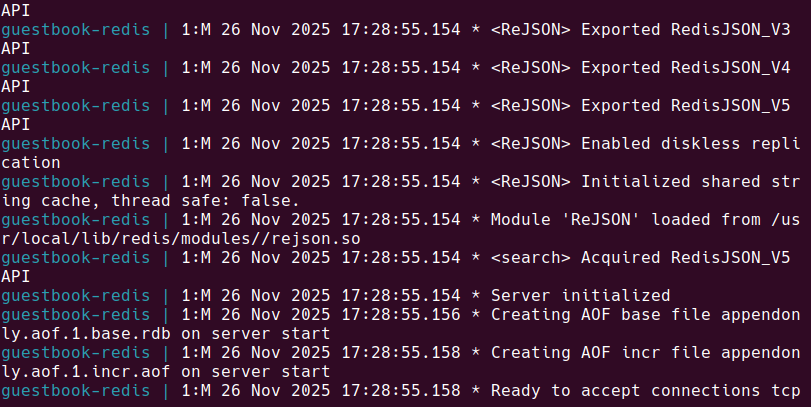
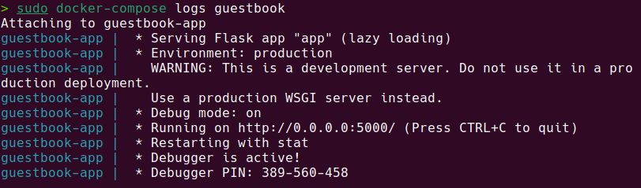
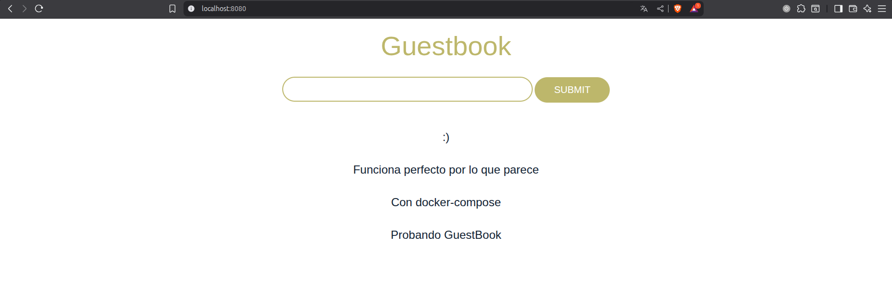
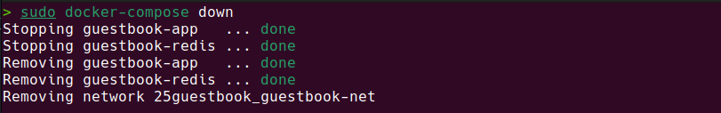
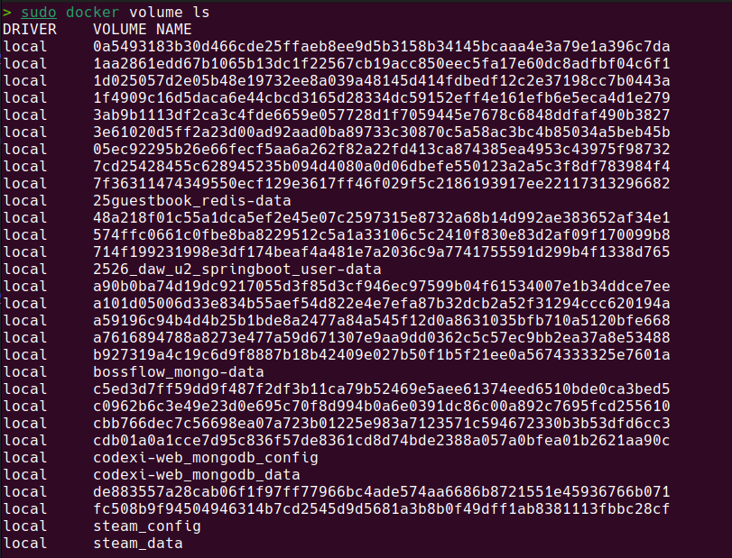
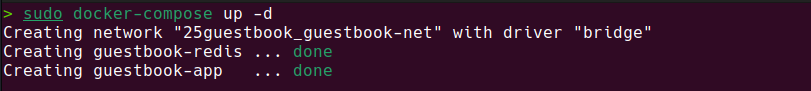
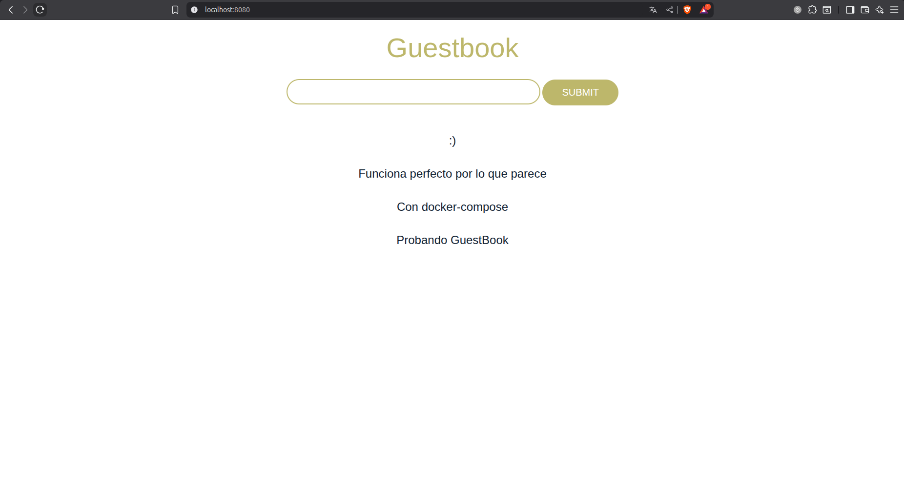
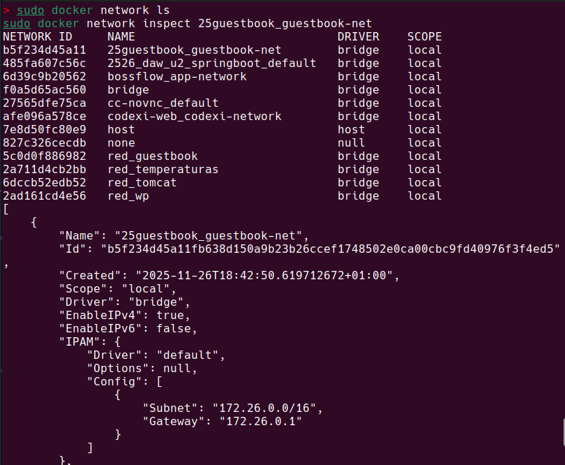
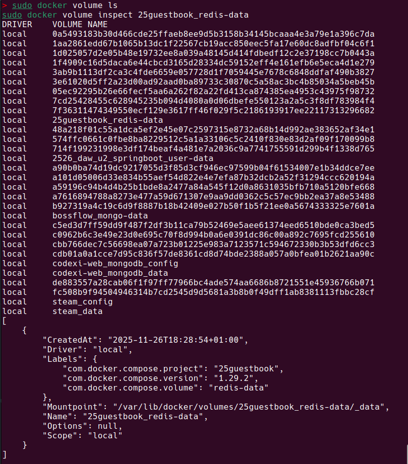

# GuestBook - Despliegue con Docker Compose

## Información del Proyecto

- **Nombre del Proyecto:** GuestBook
- **Autor:** Jesús López Pérez
- **Fecha:** 22/11/2025
- **Asignatura:** Despliegue de Aplicaciones Web

---

## 1. Archivo docker-compose.yml

### 1.1 Archivo Completo

```yaml
version: '3.8'

services:
  redis:
    image: redis
    container_name: ${NOMBRE_REDIS:-guestbook-redis}
    command: redis-server --appendonly yes
    volumes:
      - redis-data:/data
    restart: unless-stopped
    networks:
      - guestbook-net

  guestbook:
    image: iesgn/guestbook
    container_name: ${NOMBRE_GB:-guestbook-app}
    ports:
      - "${PUERTO_GB:-8080}:5000"
    environment:
      - REDIS_SERVER=${REDIS_SERVER:-redis}
    depends_on:
      - redis
    restart: unless-stopped
    networks:
      - guestbook-net
    deploy:
      resources:
        limits:
          cpus: '0.5'
          memory: 256M

volumes:
  redis-data:

networks:
  guestbook-net:
    driver: bridge
```

### 1.2 Descripción de Componentes

#### Servicios
- **redis**: Base de datos en memoria que almacena los mensajes del guestbook con persistencia.
- **guestbook**: Aplicación web que proporciona la interfaz para el libro de visitas.

#### Volúmenes
- **redis-data**: Volumen docker que persiste los datos de Redis en `/data`

#### Redes
- **guestbook-net**: Red bridge personalizada que permite la comunicación entre servicios mediante DNS

#### Configuración adicional
- **Variables de entorno**: Almacenadas en archivo `.env`
- **Límites de recursos**: CPU 0.5 y memoria 256M en el servicio guestbook
---

## 2. Comandos de Docker Compose Utilizados

### 2.1 Comandos Principales

```bash
# Iniciar en segundo plano
docker-compose up -d

# Iniciar y ver el proceso en tiempo real
docker-compose up

# Detener sin eliminar
docker-compose stop

# Iniciar servicios previamente parados
docker-compose start

# Reiniciar servicios
docker-compose restart

# Detener y eliminar contenedores y redes (mantiene los volúmenes)
docker-compose down

# Detener y eliminar todo
docker-compose down -v
```

### 2.2 Comandos de Inspección

```bash
# Ver estado de los servicios
docker-compose ps

# Ver logs de todos los servicios
docker-compose logs

# Ver logs de un servicio en concreto
docker-compose logs redis
docker-compose logs guestbook

# Seguir logs en tiempo real
docker-compose logs -f

# Ver procesos en ejecución
docker-compose top

# Validar y ver la configuración final
docker-compose config

# Ver recursos de red creados
docker network ls

# Ver volúmenes creados
docker volume ls
```

---

## 3. Capturas de Pantalla y Evidencias

### 3.1 Creación del Escenario con Docker Compose

**Comando ejecutado:**
```bash
docker-compose up -d
```

**Captura de pantalla:**



**Descripción:**
Creación de red, volúmen y servicios Redis y GuestBook

---

### 3.2 Lista de Servicios en Ejecución

**Comando ejecutado:**
```bash
docker-compose ps
```

**Captura de pantalla:**


**Descripción:**
Servicios ejecutándose, con nombre, comandos, estados y puertos utilizados

---

### 3.3 Logs de los Servicios

#### Logs del servicio Redis

**Comando ejecutado:**
```bash
docker-compose logs redis
```

**Captura de pantalla:**



**Descripción:**
Logs del servicio redis

---

#### Logs del servicio Guestbook

**Comando ejecutado:**
```bash
docker-compose logs guestbook
```

**Captura de pantalla:**



**Descripción:**
Logs del servicio guestbook

---

### 3.4 Aplicación Funcionando

**URL de acceso:** http://localhost:8080

**Captura de pantalla:**



**Descripción:**
Aplicación guestbook ejecutándose correctamente de manera local a través del puerto 8080 con almacenamiento de datos

---

### 3.5 Persistencia de Datos tras Recrear el Escenario

#### Paso 1: Detener el escenario
**Comando ejecutado:**
```bash
docker-compose down
```

**Captura de pantalla:**



---

#### Paso 2: Verificar que los volúmenes persisten
**Comando ejecutado:**
```bash
docker volume ls
```

**Captura de pantalla:**



---

#### Paso 3: Recrear el escenario
**Comando ejecutado:**
```bash
docker-compose up -d
```

**Captura de pantalla:**



---

#### Paso 4: Verificar que los datos persisten

**Captura de pantalla:**



**Descripción:**
Tras volver a hacer un up de ambos servicios podemos comprobar que los datos persisten correctamente

---

### 3.6 Recursos Creados Automáticamente

#### Red creada

**Comando ejecutado:**
```bash
docker network ls
docker network inspect 25guestbook_guestbook-net
```

**Captura de pantalla:**



**Descripción:**
Listado de redes e información específica de la red guestbook

---

#### Volúmenes creados

**Comando ejecutado:**
```bash
docker volume ls
docker volume inspect 25guestbook_redis-data
```

**Captura de pantalla:**



**Descripción:**
Listado de volúmenes e información de los mismos

---

## 4. Tabla Comparativa: Gestión Manual vs Docker Compose

| Aspecto | Docker run | Docker Compose |
|---------|----------------------------|----------------|
| **Creación de red** | `docker network create guestbook-net` | Automático en `docker-compose up` |
| **Creación de volúmenes** | `docker volume create redis-data` | Automático en `docker-compose up` |
| **Inicio de Redis** | `docker run -d --name redis --network guestbook-net -v redis-data:/data redis redis-server --appendonly yes` | Definido en `docker-compose.yml` |
| **Inicio de Guestbook** | `docker run -d --name guestbook --network guestbook-net -p 8080:5000 -e REDIS_SERVER=redis iesgn/guestbook` | Definido en `docker-compose.yml` |
| **Número de comandos** | 4-5 comandos separados | 1 comando: `docker-compose up -d` |
| **Complejidad** | Alta - Recordar todos los parámetros | Baja - Todo en archivo YAML |
| **Mantenibilidad** | Difícil - Comandos dispersos | Fácil - Configuración centralizada |
| **Reproducibilidad** | Baja - Depende de documentación | Alta - Archivo versionable |
| **Escalabilidad** | Manual - Comando por réplica | `docker-compose up -d --scale` |
| **Gestión de dependencias** | Manual - Orden crítico | Automática con `depends_on` |
| **Variables de entorno** | Múltiples flags `-e` | Sección `environment` o `.env` |
| **Detener servicios** | `docker stop` por cada uno | `docker-compose down` |
| **Ver logs** | `docker logs` individual | `docker-compose logs` unificado |
| **Portabilidad** | Baja - Scripts necesarios | Alta - Un archivo YAML |

### Conclusión Comparativa

Docker compose hace más fácil la gestión de las aplicaciones que trabajan con varios contenedores y ayuda a automatizar las tareas que se repiten constantemente.

---

## 5. Preguntas de Análisis

### 5.1 Docker Compose vs. comandos manuales

**¿Qué ventajas ofrece Docker Compose frente a ejecutar comandos docker run manualmente?**

La simplificación y centralización de tareas y procesos.

**¿En qué escenarios sería preferible usar comandos manuales?**

Para contenedores individuales o simples pruebas rápidas.

**¿Cómo facilita Docker Compose el trabajo en equipo?**

Haciendo uso todos de la misma versión establecida en el fichero.

---

### 5.2 Archivo docker-compose.yml

**¿Por qué se considera "Infrastructure as Code"?**

Porque define tanto servicios como redes y volúmenes en el código.

**¿Qué ventajas tiene definir la infraestructura de forma declarativa?**


**¿Cómo se versionaría este archivo en un proyecto real?**

Se hace commit junto al código fuente, se revisa en PRs y se documenta cada cambio importante en el historial de commits.

---

### 5.3 Redes en Docker Compose

**¿Qué red se crea automáticamente si no se define una explícitamente?**

La red X_default, siendo X el nombre del servicio

**¿Cómo funcionan los nombres de servicio para la resolución DNS?**

Docker Compose configura un dns interno, haciendo que puedan comunicarse haciendo uso de sus nombres.

**¿Cuándo es necesario definir redes personalizadas?**


---

### 5.4 Volúmenes Docker vs. bind mount

**¿Qué ventajas tienen los volúmenes Docker sobre bind mounts?**

Que al funcionar mediante docker la compatibilidad entre sistemas es mayor y mejor

**¿Cuándo usarías bind mount en Docker Compose?**

Para la fase de development.

**¿Cómo se gestionan los volúmenes con Docker Compose?**

Se definen en la sección `volumes:` del .yml, se crean automáticamente con `up`, persisten con `down`, y se eliminan directamente con `down -v`.

---

### 5.5 Escalabilidad

**¿Por qué no se puede escalar el servicio guestbook fácilmente?**

Por el puerto 8080 del host , ya que está mapeado a un solo contenedor. Varias  instancias crearían conflicto de puertos en el host.

**¿Cómo se podría modificar el archivo para permitir escalado?**

Cambiando el mapeo de puertos.

**¿Se puede escalar el servicio de base de datos Redis?**


---

### 5.6 Políticas de reinicio

**¿Qué significa `restart: always`?**

Que el contenedor se reiniciará siempre tras detenerse.

**¿Qué otras políticas de reinicio existen?**

- `no`: No reinicia nunca
- `on-failure`: Solo si falla
- `unless-stopped`: Solo se reinicia si se detiene de manera manual

**¿En qué casos utilizarías cada una?**

`no` para realizar tests, `on-failure` para servicios que pueden fallar ocasionalmente, `unless-stopped` para producción.

---

### 5.7 ¿Qué diferencia hay entre `docker-compose down` y `docker-compose down -v`?

Al poner -v se eliminar volúmenes, mientras que cuándo no se ponen los volúmenes persisten aunque se eliminen los contenedores.
