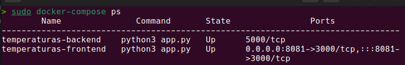
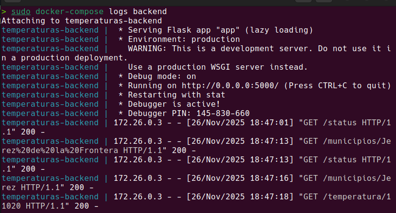
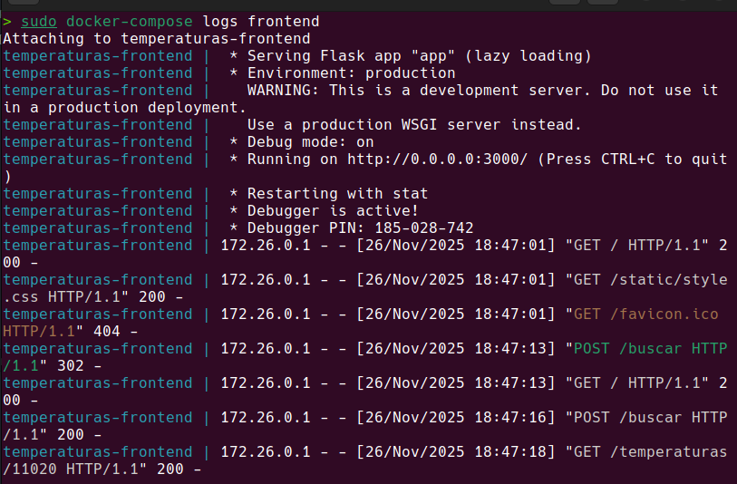
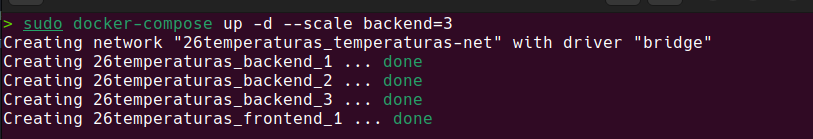
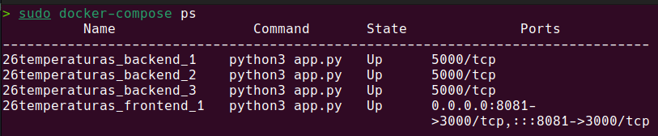

# Temperaturas - Despliegue con Docker Compose

## Información del Proyecto

- **Nombre del Proyecto:** Temperaturas
- **Autor:** Jesús López Pérez
- **Fecha:** 22/11/2025
- **Asignatura:** Despliegue de Aplicaciones Web

---

## 1. Archivo docker-compose.yml

### 1.1 Archivo Completo

```yaml
version: '3.8'

services:
  backend:
    image: iesgn/temperaturas_backend
    container_name: temperaturas-backend
    restart: always
    networks:
      - temperaturas-net

  frontend:
    image: iesgn/temperaturas_frontend
    container_name: temperaturas-frontend
    ports:
      - "8081:3000"
    environment:
      - TEMP_SERVER=backend:5000
    depends_on:
      - backend
    restart: always
    networks:
      - temperaturas-net

networks:
  temperaturas-net:
    driver: bridge
```

### 1.2 Descripción de Componentes

#### Servicios
- **backend**: API que proporciona datos de temperaturas de municipios
- **frontend**: Interfaz web para consultar las temperaturas

#### Volúmenes
- No se requieren volúmenes para esta aplicación

#### Redes
- **temperaturas-net**: Red bridge para comunicación entre servicios

#### Configuración adicional
- **Variables de entorno**: TEMP_SERVER indica la ubicación del backend
- **Dependencias**: Frontend depende del backend
- **Restart**: Política always para reinicio automático

---

## 2. Comandos de Docker Compose Utilizados

### 2.1 Comandos Principales

```bash
# Iniciar en segundo plano
docker-compose up -d

# Detener sin eliminar
docker-compose stop

# Iniciar servicios parados
docker-compose start

# Detener y eliminar
docker-compose down
```

### 2.2 Comandos de Inspección

```bash
# Ver estado de los servicios
docker-compose ps

# Ver logs
docker-compose logs
docker-compose logs backend
docker-compose logs frontend

# Logs en tiempo real
docker-compose logs -f

# Ver configuración
docker-compose config
```

---

## 3. Capturas de Pantalla y Evidencias

### 3.1 Aplicación Funcionando

**URL de acceso:** http://localhost:8081

**Captura de pantalla:**


**Descripción:**
Interfaz de la aplicación de temperaturas funcionando correctamente

---

### 3.2 Búsquedas de Municipios

**Captura de pantalla:**


**Descripción:**
Búsqueda y visualización de temperatura de un municipio

---

### 3.3 Servicios en Ejecución

**Comando ejecutado:**
```bash
docker-compose ps
```

**Captura de pantalla:**



**Descripción:**
Estado de los servicios frontend y backend ejecutándose

---

### 3.4 Logs de los Microservicios

#### Logs del Backend

**Comando ejecutado:**
```bash
docker-compose logs backend
```

**Captura de pantalla:**



**Descripción:**
Logs del backend mostrando peticiones recibidas

---

#### Logs del Frontend

**Comando ejecutado:**
```bash
docker-compose logs frontend
```

**Captura de pantalla:**



**Descripción:**
Logs del frontend mostrando el servidor web activo

---

### 3.5 Escalado de Servicios

**Comando ejecutado:**
```bash
docker-compose up -d --scale backend=3
```

**Captura de pantalla:**



**Descripción:**
Múltiples instancias del backend ejecutándose

---

**Verificación del escalado:**

**Captura de pantalla:**



**Descripción:**
Comando ps mostrando las 3 instancias del backend activas

---

## 4. Tabla Comparativa: Gestión Manual vs Docker Compose

| Aspecto | Temperaturas Manual | Temperaturas Compose |
|---------|---------------------|----------------------|
| **Comandos para desplegar** | 2 comandos docker run separados | `docker-compose up -d` |
| **Gestión de red** | `docker network create` manual | Automática |
| **Variables de entorno** | Múltiples `-e` en cada comando | Sección `environment` |
| **Escalado** | Un docker run por cada réplica | `--scale backend=N` |
| **Orden de inicio** | Manual - Backend primero | Automático con `depends_on` |
| **Logs** | `docker logs` individual | `docker-compose logs` unificado |
| **Mantenibilidad** | Difícil - Comandos dispersos | Fácil - Todo en YAML |
| **Reproducibilidad** | Baja - Requiere documentación | Alta - Archivo versionable |

### Conclusión Comparativa

Docker Compose simplifica la gestión de microservicios con un archivo centralizado y automatiza tareas como la creación de redes y gestión de dependencias.

---

## 5. Preguntas de Análisis

### 5.1 Comparación con práctica anterior

**¿Qué comandos de la Práctica 2.2 sustituye Docker Compose?**

Los comandos docker run del backend y frontend, docker network create y la gestión manual del orden de inicio.

**¿Es más fácil gestionar esta aplicación con Compose?**

Sí, todo está centralizado en un archivo y se despliega con un solo comando.

**¿Qué ventajas adicionales obtienes?**

Escalado fácil con --scale, gestión automática de dependencias con depends_on y configuración versionable.

---

### 5.2 Dependencias entre servicios

**¿Qué diferencia hay entre `depends_on` y `links`?**

depends_on define el orden de inicio. links está deprecated y se usaba para crear enlaces de red.

**¿`depends_on` garantiza que el servicio esté listo para recibir peticiones?**

No, solo garantiza que el contenedor se inicie, no que la aplicación esté lista.

**¿Cómo se podría mejorar esto con healthchecks?**

Usando healthcheck en el backend y condition: service_healthy en depends_on del frontend.

---

### 5.3 Arquitectura de microservicios

**¿Qué ventajas tiene separar frontend y backend?**

Escalado independiente, desarrollo separado con diferentes tecnologías y mantenimiento más fácil.

**¿Cómo facilita Docker Compose el desarrollo de microservicios?**

Define todos los servicios en un archivo, gestiona la comunicación automáticamente y simplifica el despliegue.

**¿Qué pasa si el backend falla? ¿Y si el frontend falla?**

Si falla el backend, el frontend no puede obtener datos. Si falla el frontend, el backend sigue funcionando pero no hay interfaz.

---

### 5.4 Escalado

**¿Por qué es más fácil escalar el backend que el frontend?**

El frontend tiene puerto fijo (8081) mapeado. El backend no expone puertos, así que puede tener múltiples instancias sin conflictos.

**¿Cómo se distribuirían las peticiones con múltiples backends?**

Docker hace round-robin DNS entre las instancias del mismo servicio.

**¿Necesitarías un balanceador de carga?**

Para producción sí, para desarrollo el DNS de Docker es suficiente.
