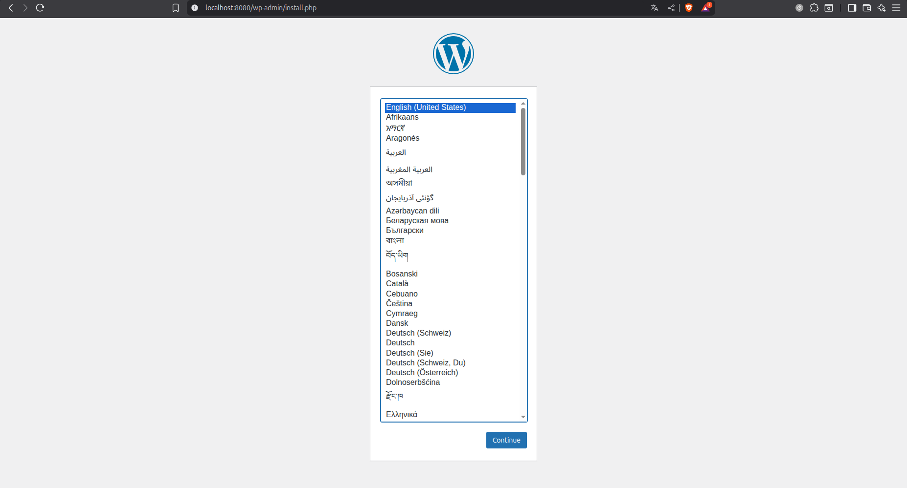
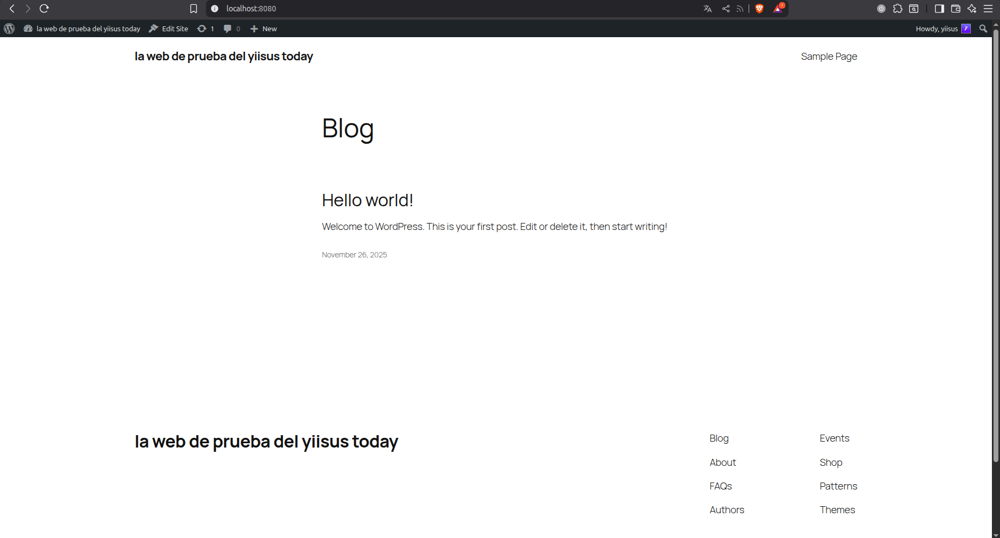
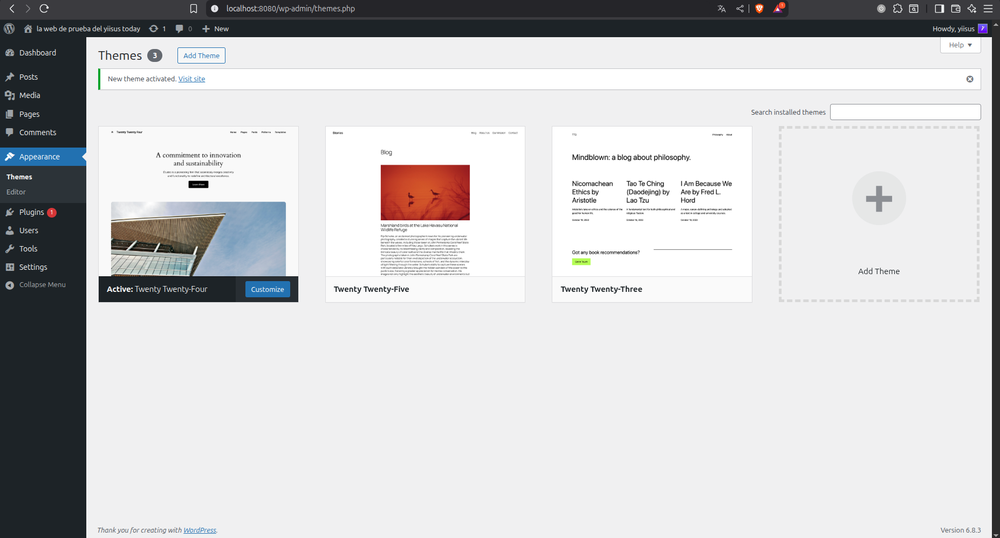
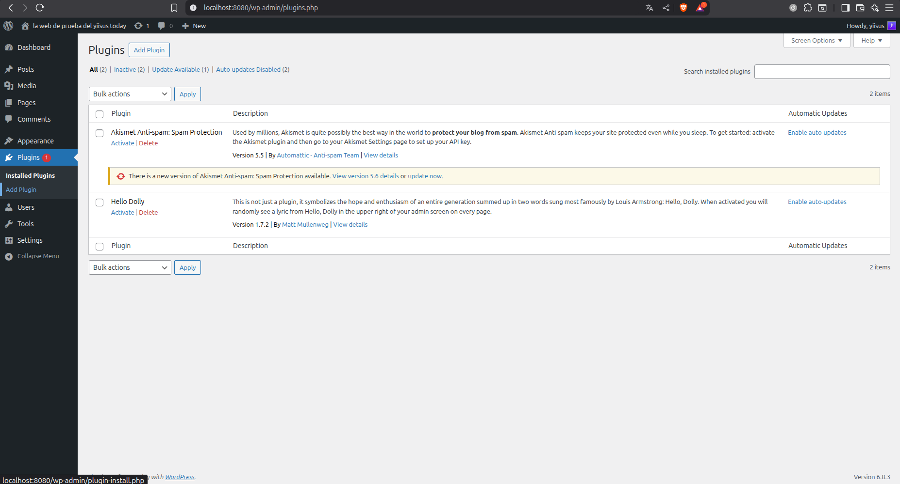
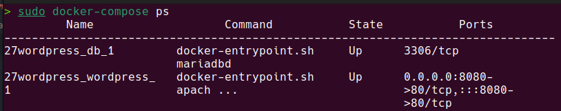
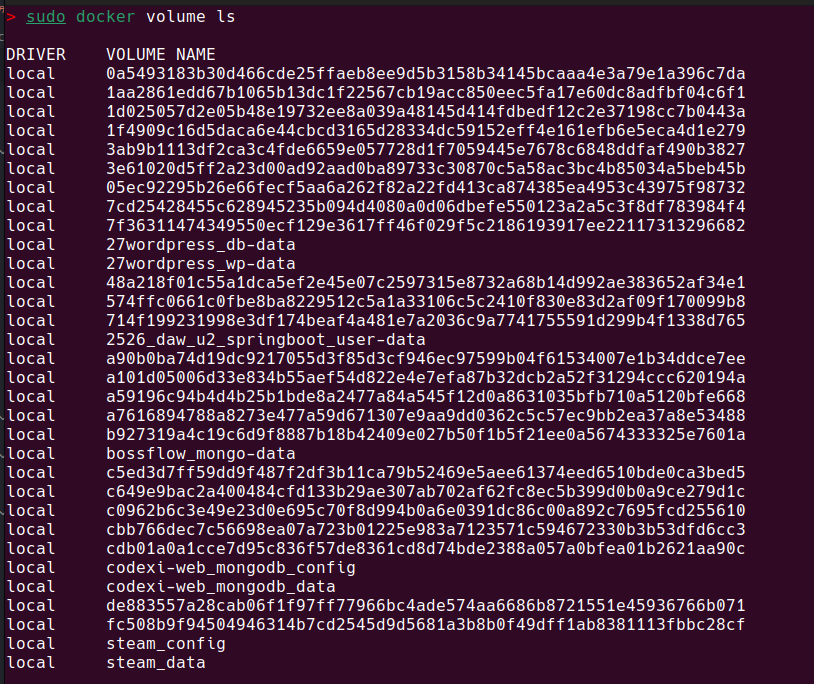

# WordPress - Despliegue con Docker Compose

## Información del Proyecto

- **Nombre del Proyecto:** WordPress con MariaDB
- **Autor:** Jesús López Pérez
- **Fecha:** 22/11/2025
- **Asignatura:** Despliegue de Aplicaciones Web

---

## 1. Archivos docker-compose.yml

### 1.1 Versión con Volúmenes Docker

```yaml
version: '3.8'

services:
  db:
    image: mariadb
    restart: always
    environment:
      - MYSQL_ROOT_PASSWORD=rootpass
      - MYSQL_DATABASE=wordpress
      - MYSQL_USER=wpuser
      - MYSQL_PASSWORD=wppass
    volumes:
      - db-data:/var/lib/mysql
    networks:
      - wordpress-net

  wordpress:
    image: wordpress
    restart: always
    ports:
      - "8080:80"
    environment:
      - WORDPRESS_DB_HOST=db
      - WORDPRESS_DB_USER=wpuser
      - WORDPRESS_DB_PASSWORD=wppass
      - WORDPRESS_DB_NAME=wordpress
    depends_on:
      - db
    volumes:
      - wp-data:/var/www/html/wp-content
    networks:
      - wordpress-net

volumes:
  db-data:
  wp-data:

networks:
  wordpress-net:
    driver: bridge
```

**Descripción:**
Esta versión usa volúmenes Docker gestionados por Docker para persistir los datos de MariaDB y WordPress.

---

### 1.2 Versión con Bind Mounts

```yaml
version: '3.8'

services:
  db:
    image: mariadb
    restart: always
    environment:
      - MYSQL_ROOT_PASSWORD=rootpass
      - MYSQL_DATABASE=wordpress
      - MYSQL_USER=wpuser
      - MYSQL_PASSWORD=wppass
    volumes:
      - ./db_data:/var/lib/mysql
    networks:
      - wordpress-net

  wordpress:
    image: wordpress
    restart: always
    ports:
      - "8080:80"
    environment:
      - WORDPRESS_DB_HOST=db
      - WORDPRESS_DB_USER=wpuser
      - WORDPRESS_DB_PASSWORD=wppass
      - WORDPRESS_DB_NAME=wordpress
    depends_on:
      - db
    volumes:
      - ./wordpress_data:/var/www/html/wp-content
    networks:
      - wordpress-net

networks:
  wordpress-net:
    driver: bridge
```

**Descripción:**
Esta versión usa bind mounts que mapean directorios del host directamente a los contenedores.

---

### 1.3 Archivo .env

```bash
# MariaDB
MYSQL_ROOT_PASSWORD=rootpass
MYSQL_DATABASE=wordpress
MYSQL_USER=wpuser
MYSQL_PASSWORD=wppass

# WordPress
WORDPRESS_DB_HOST=db
WORDPRESS_DB_USER=wpuser
WORDPRESS_DB_PASSWORD=wppass
WORDPRESS_DB_NAME=wordpress

# Puertos
WORDPRESS_PORT=8080
```

---

## 2. Comandos de Docker Compose Utilizados

### 2.1 Comandos Principales

```bash
# Iniciar con volúmenes docker
docker-compose -f docker-compose-volumes.yml up -d

# Iniciar con bind mounts
docker-compose -f docker-compose-bindmounts.yml up -d

# Detener sin eliminar
docker-compose stop

# Detener y eliminar
docker-compose down

# Detener y eliminar todo incluyendo volúmenes
docker-compose down -v
```

### 2.2 Comandos de Backup y Restauración

```bash
# Backup de volumen MariaDB
docker run --rm -v 27wordpress_db-data:/data -v $(pwd):/backup alpine tar czf /backup/db-backup.tar.gz -C /data .

# Backup de volumen WordPress
docker run --rm -v 27wordpress_wp-data:/data -v $(pwd):/backup alpine tar czf /backup/wp-backup.tar.gz -C /data .

# Restaurar volumen MariaDB
docker run --rm -v 27wordpress_db-data:/data -v $(pwd):/backup alpine tar xzf /backup/db-backup.tar.gz -C /data

# Restaurar volumen WordPress
docker run --rm -v 27wordpress_wp-data:/data -v $(pwd):/backup alpine tar xzf /backup/wp-backup.tar.gz -C /data
```

### 2.3 Comandos de Inspección

```bash
# Ver estado de los servicios
docker-compose ps

# Ver logs
docker-compose logs
docker-compose logs db
docker-compose logs wordpress

# Ver volúmenes
docker volume ls
```

---

## 3. Capturas de Pantalla y Evidencias

### 3.1 WordPress Funcionando

**URL de acceso:** http://localhost:8080

**Captura de pantalla:**



**Descripción:**
WordPress instalado y funcionando correctamente

---

### 3.2 Contenido Creado

#### Páginas creadas

**Captura de pantalla:**



**Descripción:**
Páginas creadas en WordPress

---

#### Posts/Entradas

**Captura de pantalla:**


**Descripción:**
Entradas del blog creadas

---

#### Tema instalado

**Captura de pantalla:**



**Descripción:**
Tema personalizado instalado y activado

---

#### Plugins instalados

**Captura de pantalla:**



**Descripción:**
Plugins instalados en WordPress

---

### 3.3 Servicios en Ejecución

**Comando ejecutado:**
```bash
docker-compose ps
```

**Captura de pantalla:**



**Descripción:**
Estado de los servicios WordPress y MariaDB

---

### 3.4 Estructura de Volúmenes

#### Con Volúmenes Docker

**Comando ejecutado:**
```bash
docker volume ls
```

**Captura de pantalla:**



**Descripción:**
Volúmenes Docker creados y su información

---

## 4. Tabla Comparativa: Volúmenes vs Bind Mounts

| Aspecto | Volúmenes Docker | Bind Mounts |
|---------|------------------|-------------|
| **Gestión** | Gestionado por Docker | Gestionado manualmente |
| **Ubicación** | `/var/lib/docker/volumes/` | Directorio del host especificado |
| **Portabilidad** | Alta - Funciona igual en todos los SO | Baja - Depende de rutas del host |
| **Permisos** | Docker los gestiona | Pueden dar problemas de permisos |
| **Backup** | Requiere comandos específicos | Fácil - Copia directa del directorio |
| **Desarrollo** | Menos práctico | Muy práctico - Cambios en tiempo real |
| **Producción** | Recomendado | No recomendado |
| **Rendimiento** | Mejor en algunos casos | Puede ser más lento en Windows/Mac |
| **Inspección** | Requiere comandos Docker | Navegación normal de archivos |

### Conclusión Comparativa

Los volúmenes Docker son mejores para producción por su portabilidad y gestión automática. Los bind mounts son mejores para desarrollo por su facilidad de acceso directo a los archivos.

---

## 5. Tabla Comparativa: Gestión Manual vs Docker Compose

| Aspecto | WordPress Manual (Práctica 2.3) | WordPress Compose |
|---------|--------------------------------|-------------------|
| **Comandos para desplegar** | 4-5 comandos docker run | `docker-compose up -d` |
| **Gestión de red** | `docker network create` manual | Automática |
| **Variables de entorno** | Múltiples `-e` por servicio | Archivo `.env` centralizado |
| **Gestión de volúmenes** | Crear volúmenes manualmente | Automática |
| **Orden de inicio** | Manual - DB primero | Automático con `depends_on` |
| **Actualización** | Detener y recrear manualmente | `docker-compose up -d` |
| **Backup** | Comandos largos individuales | Scripts reutilizables |
| **Portabilidad** | Requiere documentación extensa | Archivo YAML versionable |

### Conclusión

Docker Compose reduce drásticamente la complejidad en aplicaciones como WordPress que requieren múltiples servicios coordinados.

---

## 6. Preguntas de Análisis

### 6.1 Volúmenes vs. bind mounts

**¿Cuándo preferirías volúmenes Docker?**

En producción, cuando necesitas portabilidad entre sistemas y gestión automática por Docker.

**¿Cuándo preferirías bind mounts?**

En desarrollo, para ver y editar archivos directamente sin entrar al contenedor.

**¿Cuál es más fácil para backups?**

Los bind mounts son más fáciles porque puedes copiar el directorio directamente. Los volúmenes requieren comandos específicos de Docker.

---

### 6.2 Seguridad

**¿Es seguro tener las contraseñas en el archivo Compose?**

No, es un riesgo de seguridad si el archivo se sube a Git o se comparte.

**¿Cómo mejorarías la seguridad usando .env?**

Usando archivo .env que no se sube a Git y usar variables para las contraseñas.

**¿Qué otras medidas de seguridad aplicarías?**

Docker secrets, cifrado de volúmenes, restringir acceso a red solo a servicios necesarios, y usar contraseñas fuertes generadas automáticamente.

---

### 6.3 Persistencia

**¿Qué pasaría si pierdes el volumen de WordPress?**

Perderías temas, plugins, uploads y configuraciones personalizadas. WordPress se reinstalaría desde cero.

**¿Y si pierdes el volumen de MariaDB?**

Perderías todos los posts, páginas, usuarios y configuración. Es mucho más crítico.

**¿Cuál es más crítico?**

El volumen de MariaDB es más crítico porque contiene todo el contenido y no se puede recuperar fácilmente.

---

### 6.4 Dependencias

**¿Por qué WordPress depende de la base de datos?**

Porque necesita la base de datos para almacenar todo el contenido y configuración. Sin ella no puede funcionar.

**¿Qué pasa si intentas iniciar WordPress sin MariaDB?**

WordPress da error de conexión a la base de datos y no se instala correctamente.

**¿depends_on garantiza que MariaDB esté lista?**

No, solo garantiza el orden de inicio del contenedor, no que MariaDB esté lista para aceptar conexiones.

---

### 6.5 Comparación con práctica anterior

**¿Cuántos comandos necesitabas en la Práctica 2.3?**

Aproximadamente 5-6 comandos: crear red, crear volúmenes, iniciar MariaDB, iniciar WordPress.

**¿Cuántos comandos necesitas con Docker Compose?**

Solo 1: `docker-compose up -d`

**¿Qué es más fácil de mantener?**

Docker Compose es mucho más fácil porque toda la configuración está en un archivo versionable.

---

## 7. Escenarios de Uso

### 7.1 Desarrollo local

**¿Volúmenes o bind mounts?**

Bind mounts, para poder editar temas y plugins directamente desde el editor sin entrar al contenedor.

---

### 7.2 Producción

**¿Volúmenes o bind mounts?**

Volúmenes Docker, por seguridad, portabilidad y mejor rendimiento.

---

### 7.3 Testing/CI

**¿Volúmenes o bind mounts?**

Volúmenes Docker, porque son más rápidos de crear/destruir y no dependen de la estructura del host.

